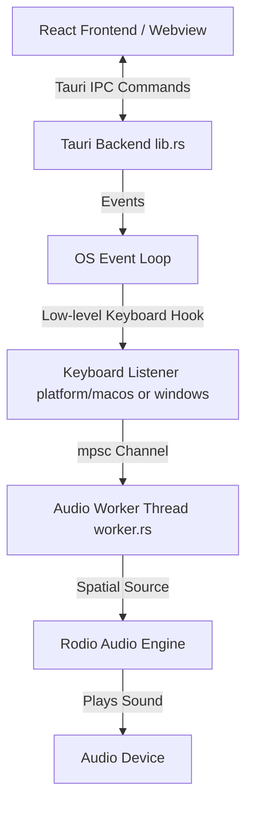

# Kliky: App Architecture & Happy Path Overview

Kliky is a lightweight, cross-platform desktop application (built with Tauri, Rust, and React/TypeScript) that provides satisfying typewriter/keyboard sound effects in real-time as users type across their system. It features modern spatial audio, organic pitch variations, speed-based volume scaling, custom shortcut support, and a dual distribution/license system (Polar License vs. Setapp Build).

---

## 1. System Components & Architecture

*   **Frontend (TypeScript/React):** Renders the user onboarding flow, settings dashboard, and sound preview playground. It communicates with Rust using Tauri’s `invoke` IPC mechanism.
*   **Tauri Backend (`lib.rs` / `commands.rs`):** Manages window lifecycle, system tray integration, app configuration persistence (`state.rs`), and the background updater.
*   **Keyboard Hook Subsystem (`platform/`):** Listens to system-wide keystrokes using native macOS (`CGEventTap`) or Windows (`SetWindowsHookEx`) APIs.
*   **Audio Pipeline (`worker.rs` / `audio.rs`):** Consumes keypresses from an asynchronous thread-safe `mpsc` queue and feeds them into the `rodio` audio library with real-time panning, speed adjustments, and volume scaling.
*   **System Tray (`tray.rs`):** Implements a menu that exposes quick volume controls, sound engine switches, and settings/playground shortcuts. Left-clicking the icon instantly reveals the settings screen.

---

## 2. The Happy Path User Journey

```mermaid
sequenceDiagram
    autonumber
    actor User
    participant App as App.tsx (React)
    participant Core as lib.rs (Rust)
    participant Tray as tray.rs (Tray Menu)
    participant Engine as worker.rs (Audio Engine)

    User->>Core: Launch Kliky
    Note over Core: Checks state: has_onboarded == false
    Core->>App: Route to Onboarding Window (Dock Icon Visible)
    User->>App: Click Grant Input Monitoring Permission
    App->>Core: request_permissions() -> Open MacOS Settings Dialog
    User->>App: Enter License Code / Run Trial
    User->>App: Click "Finish Setup"
    App->>Core: complete_onboarding()
    Note over Core: Save has_onboarded = true & set Accessory mode (Dock Hidden)
    Core->>Tray: setup_tray() (Spawns system tray menu)
    Core->>Engine: start_keyboard_listener()
    
    rect rgb(20, 20, 30)
        Note over User, Engine: Typing Background Loop
        User->>Engine: Press key 'A'
        Engine->>Engine: Apply pitch variance + stereo pan left
        Engine->>Tray: Show "A" title briefly
        Engine->>User: Play Zenith linear click sound
    end
```

---

## 3. Dual Distribution Pipeline (Setapp vs. Direct)

Kliky uses conditional compilation (`#[cfg(feature = "setapp")]` / `is_setapp_build()`) to control its distribution features:

| Feature | Direct Download Build | Setapp Build |
| :--- | :--- | :--- |
| **Updater** | Uses custom `tauri-plugin-updater` background checker | Excludes updater plugin (Setapp manages client updates) |
| **Licensing** | Polar License Gate in Onboarding | Checks Setapp client entitlements on boot; hides licensing pages |
| **Settings About Section** | Shows license activation & checkout cards | Displays Setapp Support and integration details |
| **Build Command** | `yarn tauri:build:direct` | `yarn tauri:build:setapp` (sets `KLIKY_SETAPP=1`) |
